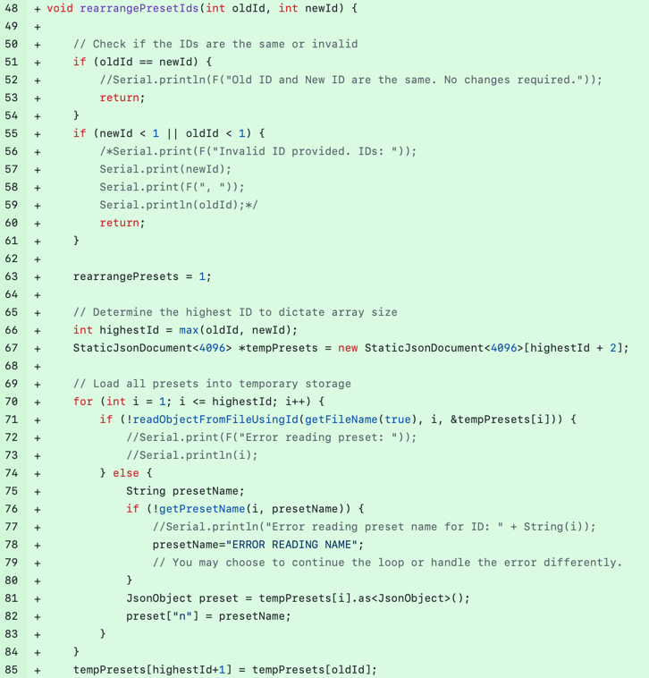

# Rearranging presets [#3773](https://github.com/Aircoookie/WLED/issues/3773)

## Issue Description and Requirements

From the original issue description we can reed the following:

**Is your feature request related to a problem? Please describe.**

Rearranging presets requires juggling IDs and is very tiresome.

**Describe the solution you'd like**

An option to rearrange presets and have WLED automatically update their IDs to reflect the changes.
Changes could be saved locally until you applied them to avoid issues.

**Additional context**

I use my WLED setup most of the day since it's my preferred light source in my room. I control it with an IR remote most of the time and because of that it's important that my presets are well organized for ease of access when cycling between them.

The current version of WLED allows the user to see the Presets ordered alphabetically or by id. The author of the issue wants to change the ID of a Preset in order to rearrange the order of the presets. Before this fix, if you try to change the ID of a preset, it will just create a copy of the Preset and override the preset that had that ID. 
This allows changing the Preset ID without overriding the old Preset that had that ID, shifting the other Preset IDs in order to allow the new one to fit in between.

## Changes to the source code files

The changes on the source code can be checked on the [Pull Request #3929](https://github.com/Aircoookie/WLED/pull/3929). 

The fix was applied in the ``wled00/presets.cpp``:

## Desing of the fix

The fix involved creating a function named `rearrangePresetIds(int oldId, int newId)` which loads all presets into memory and reassigns the ID of the preset with `oldId` to `newId`. For instance, if there are three presets with IDs 1 to 3 and we want the preset with ID 3 to be reassigned to ID 1, then the preset with ID 2 will be moved to ID 3, and the preset with ID 1 will be reassigned to ID 2.

To support this function, two new functions were introduced: `getPresetNameFromJsonObject()` and `findPresetIdByName()`. These functions are designed to more easily retrieve a preset's name and to find a preset's ID using its name, respectively.

To invoke the `rearrangePresetIds()` function, a serie s of conditional statements have been added to the `savePreset()` function within the section of the code responsible for updating presets.

This fix was tested on an ESP32 controller, and it was observed that saving the new IDs of the presets corrupted the .json file that stores them. To rule out any hardware issues, another ESP32 was used, confirming that the problem was not hardware-related. The issue was resolved by introducing a `delay(100)` function, which pauses the program for 100 milliseconds between modifications to the .json file, thus preventing corruption.
